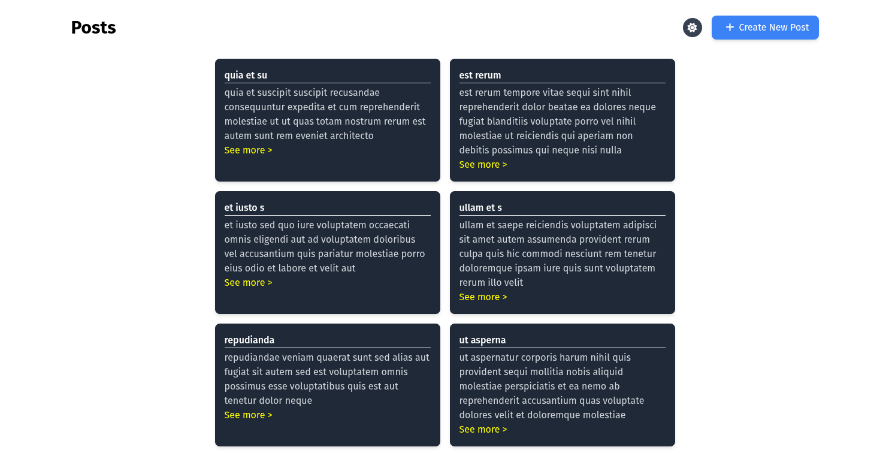
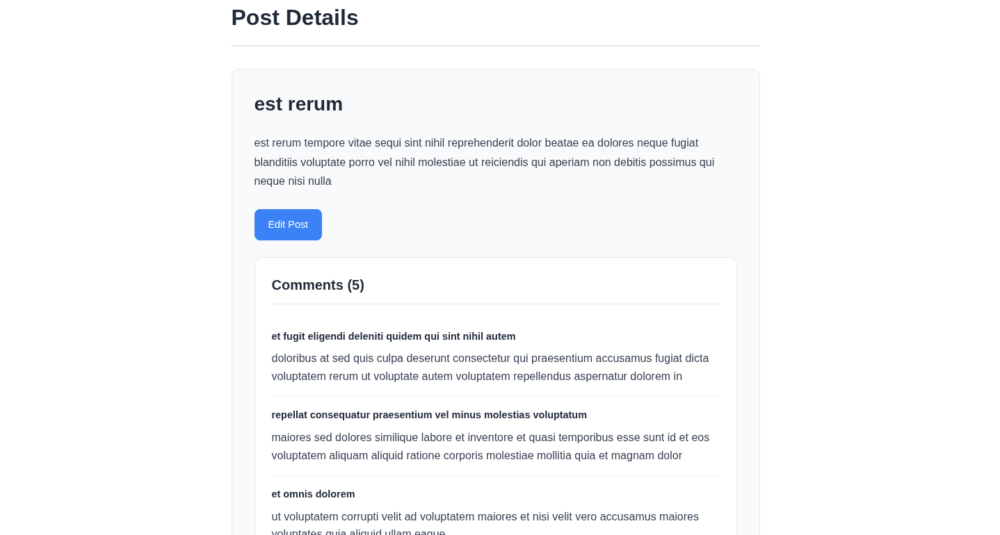

# Angular API Master Project

A production-ready Angular application demonstrating full API integration, authentication, error handling, caching, pagination, and route protection using standalone components.

---

##  Features

- Post listing, creation, editing, and viewing
- API error handling with retry logic
- Route protection using guards
- Auth token handling with interceptor
- Pagination with cache support
- Environment-specific API configurations

---

## Setup & Run Instructions

```bash
npm install
ng serve
```

Visit: `http://localhost:4200`

---

## Credentials

Use `admin` / `admin` to login.

---

## Environment Config

- Development: `src/environments/environment.ts`
- Production: `src/environments/environment.prod.ts`

---

##  Build for Production

```bash
ng build --configuration production
```

---

##  Project Structure

```
src/
  app/
    components/
    services/
    guards/
    interceptors/
    app.routes.ts
    app.config.ts
  environments/
```

---

##  Available Scripts

| Command | Description |
|---------|-------------|
| `ng serve` | Start dev server |
| `ng build` | Build for production |
| `ng generate ...` | Generate components, services, etc |

---

##  Author

**Faisal Halid Dene**  
X: https://x.com/processor_911

---

## Screenshots

| Feature | Screenshot |
|--------|------------|
| Home Page |  |
| Post Details |  |
| Create Post |  |
| Login Page |  |


---

##  What I Learned

- Angular standalone architecture
- Clean service and state separation
- Real-world API communication patterns